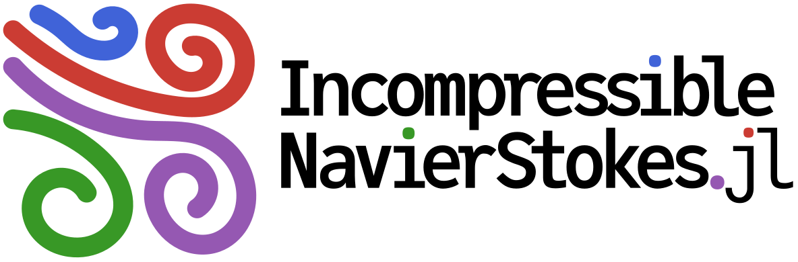
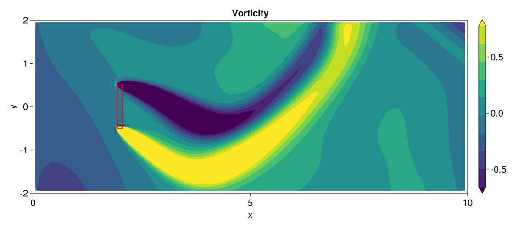
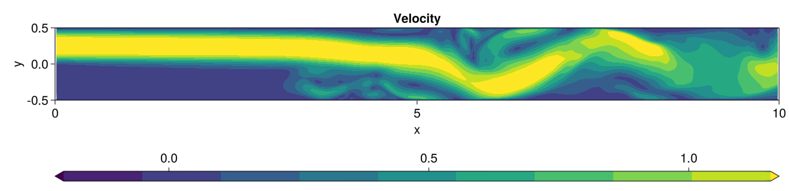
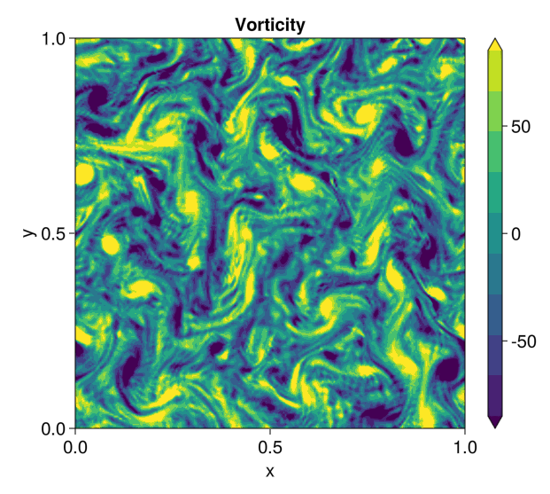
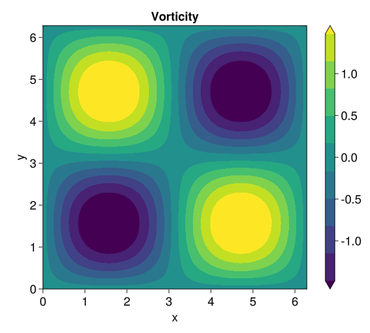
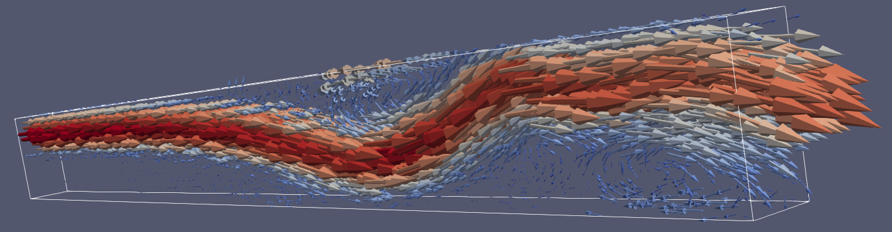
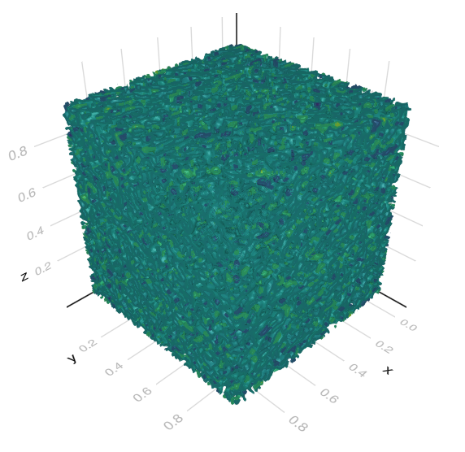
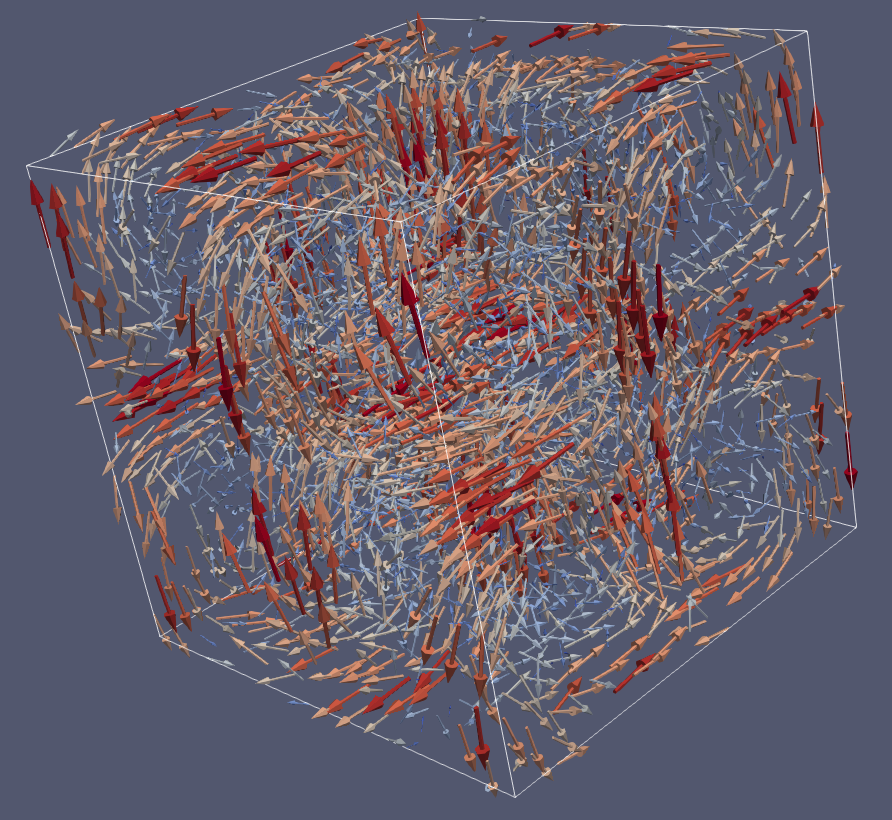

# IncompressibleNavierStokes

| Documentation | Workflows | Code coverage | Quality assurance |
| :-----------: | :-------: | :-----------: | :---------------: |
| [](https://agdestein.github.io/IncompressibleNavierStokes.jl/stable) [](https://agdestein.github.io/IncompressibleNavierStokes.jl/dev) | [](https://github.com/agdestein/IncompressibleNavierStokes.jl/actions) | [](https://codecov.io/gh/agdestein/IncompressibleNavierStokes.jl) | [](https://github.com/JuliaTesting/Aqua.jl) |

This package implements energy-conserving solvers for the incompressible Navier-Stokes
equations on a staggered Cartesian grid. It is based on the Matlab package
[INS2D](https://github.com/bsanderse/INS2D)/[INS3D](https://github.com/bsanderse/INS3D).


## Installation

To install IncompressibleNavierStokes, open up a Julia-REPL, type `]` to get
into Pkg-mode, and type:

```
add IncompressibleNavierStokes
```

which will install the package and all dependencies to your local environment.
Note that IncompressibleNavierStokes requires Julia version `1.7` or above.

See the
[Documentation](https://agdestein.github.io/IncompressibleNavierStokes.jl/dev/generated/LidDrivenCavity2D/)
for examples of some typical workflows. More examples can be found in the
[`examples`](examples) directory.

## Gallery

The velocity and pressure fields may be visualized in a live session using
[Makie](https://github.com/JuliaPlots/Makie.jl). Alternatively,
[ParaView](https://www.paraview.org/) may be used, after exporting individual
snapshot files using the `save_vtk` function, or the full time series using the
`VTKWriter` processor.

|      |                  |                 |                 |
|:---------------------------------------:|:-------------------------------------------------------------:|:------------------------------------------------------------:|:-----------------------------------------------------------:|
| [Actuator (2D)](examples/Actuator2D.jl) | [Backward Facing Step (2D)](examples/BackwardFacingStep2D.jl) | [Decaying Turbulence (2D)](examples/DecayingTurbulence2D.jl) | [Taylor-Green Vortex (2D)](examples/TaylorGreenVortex2D.jl) |
|      |                  |                 |                 |
| [Actuator (3D)](examples/Actuator3D.jl) | [Backward Facing Step (3D)](examples/BackwardFacingStep3D.jl) | [Decaying Turbulence (3D)](examples/DecayingTurbulence3D.jl) | [Taylor-Green Vortex (3D)](examples/TaylorGreenVortex3D.jl) |
